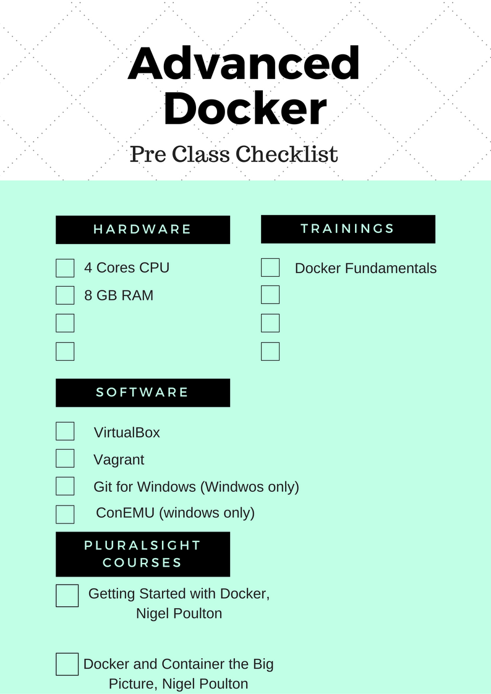

# Advanced Docker Bootcamp
---------

|      |      |
| :------------- | :------------- |
| Duration       | 2days     |
| Level     | Intermediate, Advanced |
| Modules          | 09 |
| Nano Projects | xx |
| Customizable  | Yes |

## Objectives

This course follows a hands on  workshop method and builds advanced docker skills on top of existing skills learnt in Docker Fundamentals.

## Who is this for ?

This course is for someone who has already taken docker fundamentals course and would like to learn advanced topics such as how to integrate docker into developement and continuous integration workflows, how to add security while building as well as running container systems, how to create custom base images, registries  etc. as well as setting up auxiliary services such as monitoring and centralized logging for container systems.

## Who is this not for ?

  * If you are a advanced user of docker already, this course is definitely not for you.
  * If you are interested in learning docker on windows, this course is not ideal for you as it focuses on linux containers, even though docker is now supported on windows.
  * If you have already taken Docker Fundamentals, and interested in learning container orchestration and production deployments, you may want to consider **Kubernetes Bootcamp** instead.

## What will you do as part of this course ?

As part of this course you will,  

   * Install and configure docker by hand on a generic linux os, setup certificates  and connect to it from a remote client.
   * Learn about best practices and methods that you could incorporate to use docker for packaging as well as testing applications.
   * Learn to create your own custom **base images** instead of using parent images from the registry/third party.
   * Create a custom registry using **Harbor**, setup users and access and incorporate it into your workflow.
   * Incorporate security best practices while building and distributing docker images.
   * Learn how to run **docker bench** security scan and enhance run time security.
   * Integrate docker with jenkins to setup **continuous integration** environment for micro services based application.

## What is not covered ?

Since this course is a beginner level, its not meant to cover advanced concepts such as,

  * Advanced Container Orchestration
  * Multi Host Networking/Overlay/CNI
  * Writing Micro Services Applications
  * Production grade docker setup and deployment
  * Cloud Integrations

## Pre Requisites

Following are the pre requisite skills to attend this course. Since its a beginner level course, no prior experience with linux containers is assumed.  

### Courses

You should have attended the following course, or have demonstrable knowledge with the topics included in the following course.

  * Docker Fundamentals

Pre Assessment test will be conducted at the beginning of the course to asses the skills.

### Skills

  * Docker Usage  
    * Running Containers
    * Building Images and writing Dockerfiles
    * Docker Compose  
    * Docker Networking and Storage
  * Linux/Unix Systems Fundamentals
  * Familiarity with Command Line Interface (CLI)
  * Fundamental knowledge of editors on linux (any one of vi/nano/emacs)

### Hardware and Software  Requirements

These are the prerequisites for each attendee.

| Hardware Requirements | Software Requirements |
| :---------------------| :--------------------- |
| Laptop/Desktop with high speed internet connection | Base Operating System : Windows / Mac OSX |
| 8 GB RAM | VirtualBox  |
| 4 CPU Cores | Vagrant |
| 20 GB Disk Space available | ConEmu (Windows Only) |
| | Git for Windows (windows only) |

Lab Setup : Instructions can be found at xxx

## Supporting Content/Materials

Following is the supporting material which will be provided to you before/during the course  
  * Slides (online)  
  * Workshop (online link)  
  * Video Course - XXX by School of Devops  

## Pre Class Checklist

All participants should have completed the following checklist before attending the course .

  * Successfully Completed  **Docker Fundamentals** Course, or have equivalent skills.
  * Verify  your system meets the  hardware pre requisites.
  * Validate the setup : verify all pre requisite software is installed on your system and is functional.
  * Join our [docker channel on gitter](https://gitter.im/schoolofdevops/docker?utm_source=share-link&utm_medium=link&utm_campaign=share-link)

## Topics
Following are the topics which would be covered as part of this course. Detailed course outline follows.

  * Custom Docker Installation and Configuration
  * Introduction to Use Case - Mogambo.com
  * Building Custom Base Images
  * Deploying a Custom Registry - Harbor
  * Building and Distributing Secure Images
  * Securing Container Runtimes
  * Continuous Integration with Docker
  * Setting Up Monitoring
  * Centralized Log Management

## Customizing the Course: Possible Additional Topics

Following topics are **not included** but can be added in order to customize this training. You are welcome to suggest topics based on the relevance.

  * Cloud and Docker : AWS, GCE, Azure
  * Going serverless with Docker
  * Being 12 Factor compliant with Docker
  * docker-machine primer
  * Linuxkit / Infrakit and Docker Moby
  * Flocker for  docker storage
  * Persistent storage related topics

## Detailed Course Outline
This is the detailed course outline with day wise list of contents

### Day I

## Introduction and Pre Assessment
  * Trainer, class and course introduction
  * Pre Assessment Test

#### Module 1: Custom Docker Installation and Configuration
  * Setup a linux VM
  * Install Docker with package manager
  * Install Docker Compose
  * Docker daemon configuration
  * Run Docker on a port with certs
  * Configure local docker client to talk to remote server with certificates

#### Module 2: Introduction to Use Case - Mogambo.com
  * Mogambo - the Organization and the application
  * Overview of the Architecture
  * Code overview and the best practices the developers can incorporate
    * Application Repositories
    * Dockerfiles
    * Compose Specs
    * Makefiles
  * Demo of build, test, deploy etc.,
  * Local image distribution with load/save

#### Module 3: Building Custom Base Images
  * Parent images Vs Base images
  * Building a custom image with scratch
  * Creating a custom Ubuntu image with the bootstrap
  * Creating a CentOS image using a scripted approach

#### Module 4: Deploying a Custom Registry - Harbor
  * Introduction to Harbor by VMware
  * Install and Configure Harbor
  * Harbor Walkthrough
  * Working with a custom registry
  * Push/Publish images to Harbor

#### Module 5:Building and Distributing Secure Images
  * Dockerfiles with USER and gosu / COPY Vs ADD
  * Registry with RBAC
  * Vulnerability Scanning for Images
  * Enabling Content Trust
  * Using Notary to sign images

### Day II

#### Module 6: Securing Container Runtimes
  * Host Security
    * SELinux
    * Apparmor
    * Updates & Patches
    * Linuxkit & Infrakit
  * Run Docker Bench Script for security scan
  * Securing Docker Daemon
    * Network traffic
    * Logging level
    * TLS
    * Ulimit default
  * Securing Container Runtime
    * Security Options
    * Memory and CPU restrictions
    * Restart, Policies
    * Ulimits
    * Capablities

#### Module 7: Continuous Integration with Docker
  * Docker based build, test, unit tests, e2d tests, setup for Mogambo
  * Makefiles & Scripts
  * Setting up CI env with Jenkins
  * Setup a pipeline
    * Build
    * Unit Tests
    * Functional Tests
    * e2e Tests
  * Tag, Push and Publish Images

### Additional Topics if time permits

#### Module 8: Setting Up Monitoring
  * Monitoring Containers, Hosts and Applcations
  * Prometheus
  * Adding Grafana for web UI

#### Module 9: Centralized Log Management
  * Docker Log drivers
  * Setup ELK Stack or equivalent
  * Launching containers with log drivers

## Reading List

Here is the list of curated resources which you could refer to to learn about docker before the training and  and get an in depth understanding post training.  

#### Pluralsight Courses
  * [Getting Started with Docker](https://www.pluralsight.com/courses/docker-getting-started) by Nigel Poulton
  * [Docker and Container](https://www.pluralsight.com/courses/docker-containers-big-picture), the Big Picture by Nigel Poulton

#### Safaribooks Online
  * Docker: Up & Running by Karl Matthias, Sean P. Kane by Oreilly
  * Using Docker by Adrian Mouat, Oreilly

#### Tutorials
  * [Tutorials with Live Environment](https://www.katacoda.com/)
  * [Labs by Docker](https://github.com/docker/labs)
  * [Docker Tutorials by hacks.io]( https://hackr.io/tutorials/learn-docker)

### Articles
  * The Docker Story [How Docker Escaped Near-Death To Become Software’s Next Big Thing](
http://www.forbes.com/sites/alexkonrad/2015/07/01/how-docker-escaped-near-death-to-become-softwares-next-big-thing/)
